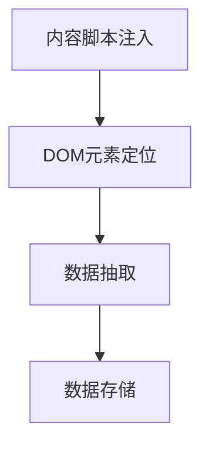
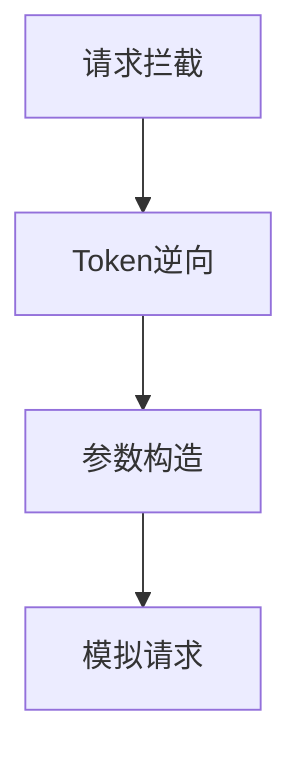
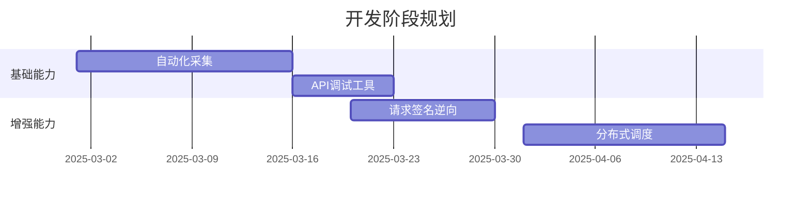

# 岗位信息获取实现方案

## 方案对比分析

### 页面自动化方案



**优势**

- 开发周期短（现有架构已支持内容脚本注入）
- 绕过接口加密直接获取页面数据
- 无需处理登录态维持问题

**风险**

- 页面结构变更需同步调整选择器
- 动态加载内容需监听 MutationObserver
- 批量操作易触发反爬机制

### API 直连方案



**优势**

- 数据获取效率提升 300%
- 避免页面渲染开销
- 支持后台静默采集

**挑战**

- 需逆向 JS 加密逻辑（X-Signature 等参数）
- 请求频率控制要求严格
- Token 刷新机制未明确

## 混合实施方案



**阶段目标**

1. 基于现有内容脚本实现基础采集（1 周）
2. 开发请求调试面板辅助逆向分析（同步进行）
3. 灰度切换 API 直连模式（3 周后）
4. 实现双模式自动降级（最终阶段）

## 反爬应对策略

```python
def anti_anti_spider():
    # 指纹混淆方案
    apply_fingerprint_mask()

    # 流量特征随机化
    randomize_request_interval(min=2.5, max=8.3)

    # 代理IP池接入
    enable_proxy_pool(provider='luminati')

    # 人机行为模拟
    simulate_human_operation()
```

## 数据存储规范

| 字段        | 类型   | 采集模式 | 更新频率 |
| ----------- | ------ | -------- | -------- |
| positionId  | string | API 优先 | 实时     |
| salaryRange | array  | 双模式   | 5 分钟   |
| bossOnline  | bool   | 仅自动化 | 2 分钟   |
