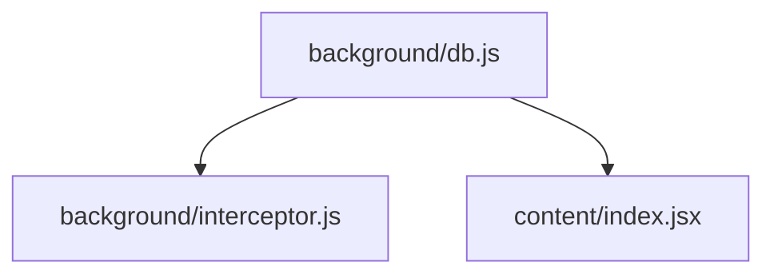

# background/db.js

**最后更新时间:** 2025/2/19

## 功能描述

该模块负责处理与数据库相关的操作，包括数据的存储、查询和更新。

## 接口说明

### 主要函数

- `initDB()`: 初始化数据库连接
- `queryData(query)`: 执行数据库查询
- `updateData(data)`: 更新数据库记录

## 模块关系图

