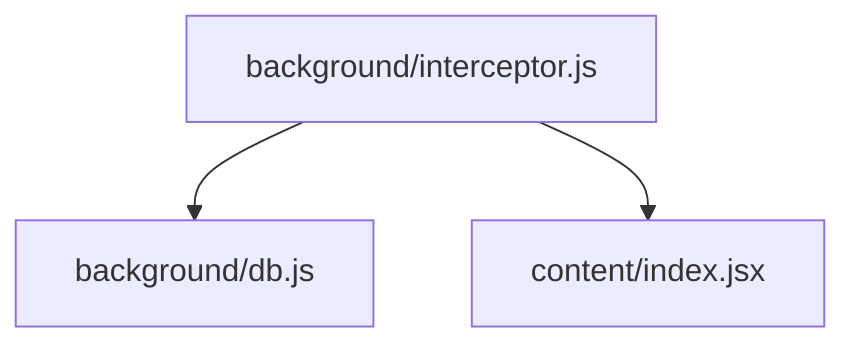

# background/interceptor.js

**最后更新时间:** 2025/2/19

## 功能描述

该模块负责拦截和处理网络请求，实现请求的监控和修改。

## 接口说明

### 主要函数

- `initInterceptor()`: 初始化请求拦截器
- `handleRequest(request)`: 处理传入的请求
- `modifyResponse(response)`: 修改响应数据

## 模块关系图

