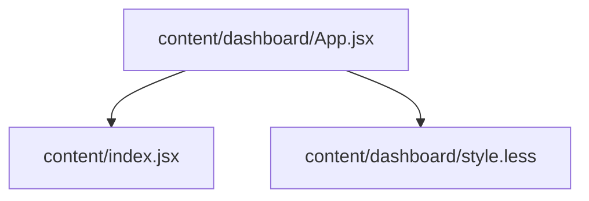

# content/dashboard/App.jsx

**最后更新时间:** 2025/2/19

## 功能描述

该模块是仪表盘的主界面组件，负责展示核心数据和交互功能。

## 主要功能

- 渲染仪表盘界面
- 处理用户交互事件
- 与后台服务进行数据通信
- 管理组件状态

## 模块关系图

```mermaid
graph TD
    A[content/dashboard/App.jsx] --> B[content/index.jsx]
    A --> C[content/dashboard/style.less]
```
