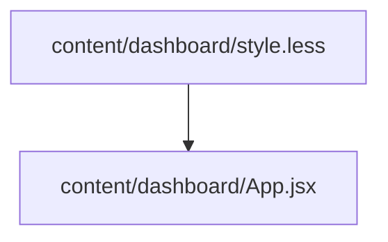

# content/dashboard/style.less

**最后更新时间:** 2025/2/19

## 功能描述

该模块包含仪表盘界面的样式定义，使用 LESS 预处理器编写。

## 主要功能

- 定义仪表盘组件的样式
- 管理主题颜色和布局
- 处理响应式设计

## 模块关系图

```mermaid
graph TD
    A[content/dashboard/style.less] --> B[content/dashboard/App.jsx]
```
