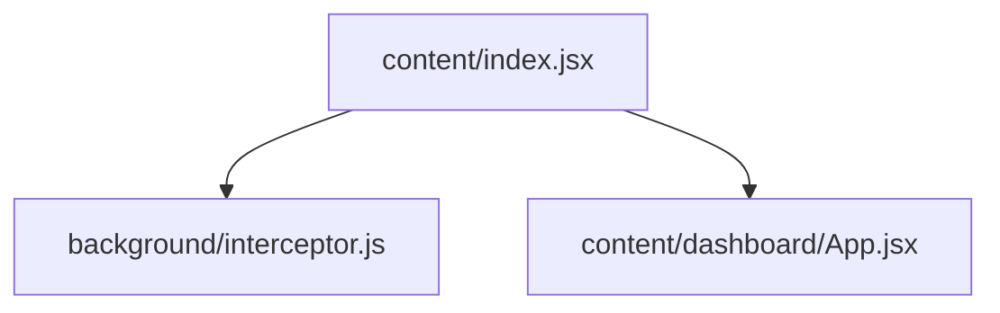

# content/index.jsx

**最后更新时间:** 2025/2/19

## 功能描述

该模块是内容脚本的入口文件，负责初始化内容脚本并注入到页面中。

## 主要功能

- 初始化内容脚本
- 注入 React 组件到页面
- 处理与 background 脚本的通信

## 模块关系图

```mermaid
graph TD
    A[content/index.jsx] --> B[background/interceptor.js]
    A --> C[content/dashboard/App.jsx]
```
