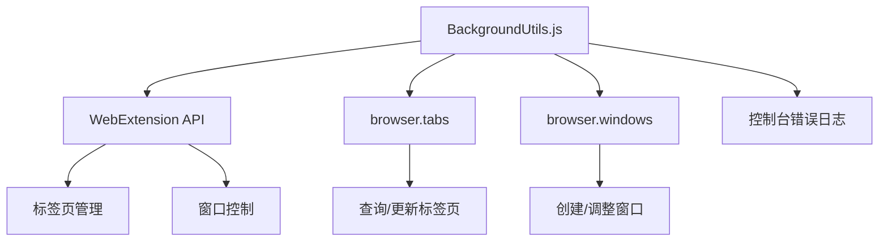

# BackgroundUtils.js 后台工具模块文档

## 功能说明

`BackgroundUtils.js` 实现浏览器扩展后台服务核心功能：

- 提供浏览器标签页和窗口管理工具方法
- 处理仪表板页面的智能打开/更新逻辑
- 支持根据当前窗口尺寸自动计算弹出窗口大小
- 实现跨窗口状态同步和错误处理机制

## 模块调用关系

```mermaid
graph TD
    A[BackgroundUtils.js] --> B[WebExtension API]
    A --> C[browser.tabs]
    A --> D[browser.windows]
    B --> E[标签页管理]
    B --> F[窗口控制]
    C --> G[查询/更新标签页]
    D --> H[创建/调整窗口]
    A --> I[控制台错误日志]
```
