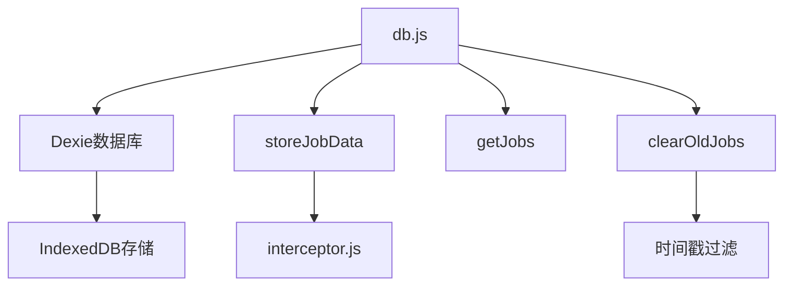

# db.js 数据库模块文档

## 功能说明

`db.js` 实现浏览器扩展的本地数据存储功能：

- 使用 Dexie 库创建 IndexedDB 数据库
- 定义职位信息(jobs)和认证令牌(tokens)的数据表结构
- 提供职位数据存储、查询和清理接口
- 实现 30 天自动清理旧数据机制

## 模块调用关系

```mermaid
graph TD
    A[db.js] --> B[Dexie数据库]
    A --> C[storeJobData]
    A --> D[getJobs]
    A --> E[clearOldJobs]
    C --> F[interceptor.js]
    B --> G[IndexedDB存储]
    E --> H[时间戳过滤]
```
