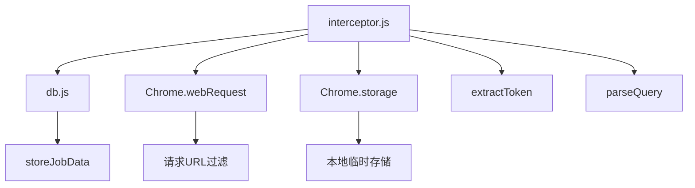

# interceptor.js 请求拦截模块文档

## 功能说明

`interceptor.js` 实现浏览器网络请求监控与数据处理：

- 拦截 BOSS 直聘网站特定 API 请求
- 处理登录接口获取认证令牌并存储到 chrome.storage
- 捕获职位列表请求并解析参数存储到数据库
- 提供 URL 参数解析和 Cookie 令牌提取工具方法

## 模块调用关系

```mermaid
graph TD
    A[interceptor.js] --> B[db.js]
    A --> C[Chrome.webRequest]
    A --> D[Chrome.storage]
    B --> E[storeJobData]
    C --> F[请求URL过滤]
    D --> G[本地临时存储]
    A --> H[extractToken]
    A --> I[parseQuery]
```
