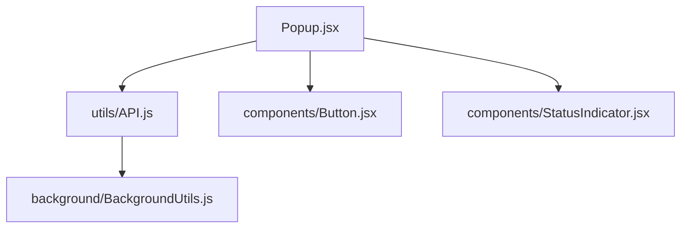

# Popup.jsx 功能说明

Popup.jsx 是浏览器扩展的弹出窗口主界面组件，主要功能包括：

- 显示当前状态信息
- 提供快捷操作按钮
- 展示通知消息

## 模块调用关系

```mermaid
graph TD
    A[Popup.jsx] --> B[utils/API.js]
    A --> C[components/Button.jsx]
    A --> D[components/StatusIndicator.jsx]
    B --> E[background/BackgroundUtils.js]
```
