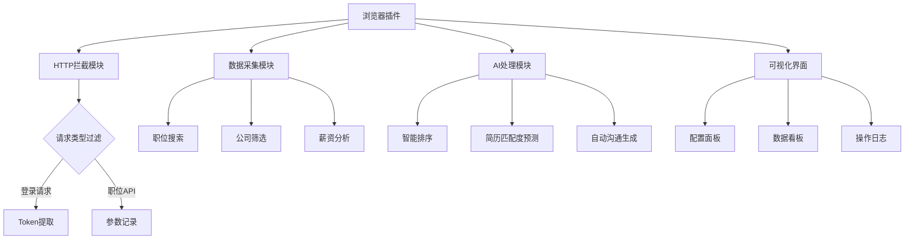

 

Boss职位智能采集插件需求文档 

一、项目可行性分析 
（一）技术可行性 
1. HTTP请求拦截  
浏览器插件可通过`webRequest`API实现请求拦截，需在manifest声明`webRequest`和`webRequestBlocking`权限。Token捕获需针对BOSS登录接口特征做正则匹配 

2. API数据采集  
基于BOSS网站接口逆向工程，建议使用浏览器调试工具分析接口参数，通过`fetch`或`XMLHttpRequest`重写实现自动化请求。需注意反爬机制处理（频率控制、请求头模拟）

3. 大模型集成  
DeepSeek API兼容OpenAI格式，可通过`axios`库实现接口调用。建议采用流式响应处理提升交互体验，需申请API Key并配置用量监控 

4. 可视化界面  
通过content scripts注入React组件，采用shadow DOM隔离样式。模态窗口建议使用Ant Design组件库，通过postMessage与后台通信 

（二）合规性风险 
- BOSS直聘接口调用需遵守《数据安全法》第27条 
- 用户数据存储需符合GDPR本地化存储要求 
- DeepSeek API需遵守《生成式AI服务管理暂行办法》

---

二、功能需求说明 
核心模块设计 



（一）HTTP拦截模块 
| 功能点       | 技术实现                                                                 | 异常处理                     |
|--------------|--------------------------------------------------------------------------|------------------------------|
| Token捕获    | 监听`/login/callback`接口响应，通过Cheerio解析Set-Cookie头               | 302重定向跟踪，双Token校验   |
| 请求参数记录 | 拦截`/job/list`接口，记录positionName、salaryRange等参数                | 参数加密解密处理             |
| 频率控制     | 基于Leaky Bucket算法实现请求队列，动态调整间隔（500ms-2s随机延迟）       | 验证码识别自动熔断           |

（二）数据采集模块 
```javascript
// 伪代码示例 
chrome.webRequest.onBeforeRequest.addListener(
  (details) => {
    if (isTargetAPI(details.url)) {
      const params = parseQueryString(details.url);
      store.dispatch('addJobQuery', params);
      return { cancel: false };
    }
  },
  { urls: ["*://www.zhipin.com/api/*"] },
  ["blocking"]
);
```

（三）AI处理模块 
1. 智能排序算法  
结合DeepSeek的`/chat/completions`接口，输入格式：
```json
{
  "model": "deepseek-chat",
  "messages": [
    {"role": "system", "content": "根据公司规模、薪资、通勤距离排序..."},
    {"role": "user", "content": "${职位数据JSON}"}
  ],
  "temperature": 0.7 
}
```

2. 简历匹配度计算  
采用Embedding API生成特征向量，余弦相似度计算：
```python
import numpy as np 
def similarity(a, b):
    return np.dot(a, b)/(np.linalg.norm(a)*np.linalg.norm(b))
```

（四）可视化界面 
1. 数据看板指标
   - 实时职位数/薪资分布热力图 
   - 竞争力分析雷达图（学历/经验/技能）
   - 企业信用评级（企查查API集成）

2. 交互设计要点
   - 支持拖拽式筛选条件组合 
   - 智能推荐搜索策略保存 
   - 数据导出（Excel/CSV/JSON）

---

三、技术实施方案 
架构设计 
```
├── manifest.json 
├── background/       # 后台服务 
│   ├── apiProxy.js   # 接口代理 
│   └── db.js         # IndexedDB操作 
├── content/          # 内容脚本 
│   ├── modal.js      # 模态窗口 
│   └── inject.css    
├── pages/            # 配置页面 
│   ├── options.html 
│   └── dashboard.html 
└── utils/
    ├── auth.js       # DeepSeek鉴权 
    └── encrypt.js    # 数据加密 
```

开发里程碑 
| 阶段   | 周期 | 交付物                          | 验证标准                     |
|--------|------|---------------------------------|------------------------------|
| Alpha  | 2周  | 基础拦截功能+数据存储           | 成功捕获100个职位API请求      |
| Beta   | 3周  | AI排序+可视化看板               | 排序准确率>85%                |
| RC     | 1周  | 浏览器商店适配+隐私政策         | 通过Chrome Web Store审核       |

---

四、风险评估与应对 
| 风险类型         | 概率 | 影响 | 应对措施                                |
|------------------|------|------|-----------------------------------------|
| BOSS接口变更     | 高   | 高   | 建立接口特征库，开发自动适配机制 |
| 反爬机制升级     | 中   | 中   | 动态IP代理池+浏览器指纹模拟             |
| DeepSeek API限流 | 低   | 高   | 请求队列+本地缓存降级方案               |
| 数据泄露         | 中   | 极高 | 端到端加密+AES-256-GCM存储              |

建议采用MITM(中间人)检测技术，当发现流量异常时自动切换备用采集方案。对于核心数据存储，使用WebCrypto API实现客户端加密。

> 完整技术细节请参考： 、  